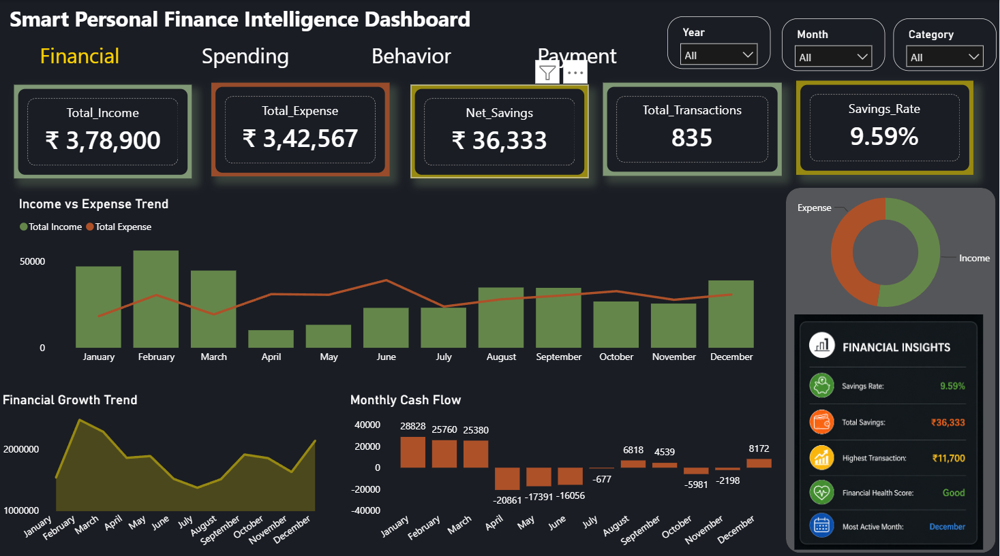
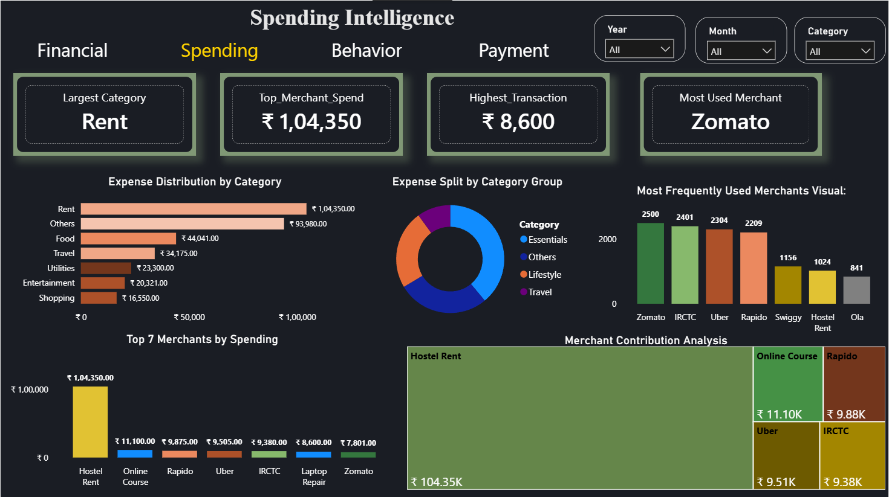
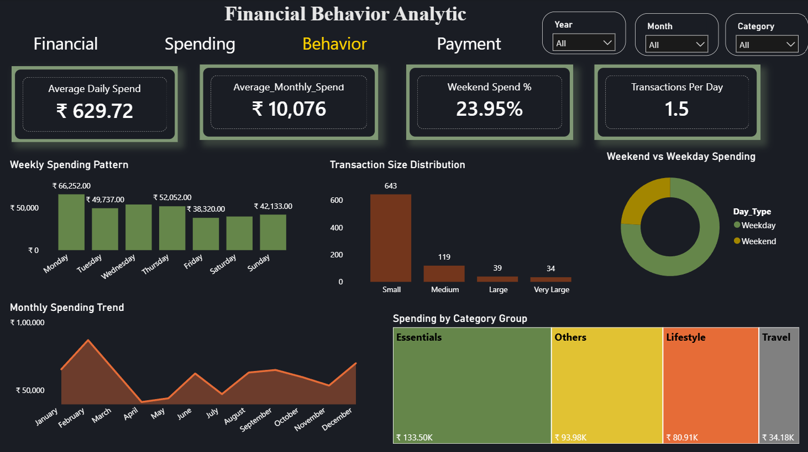
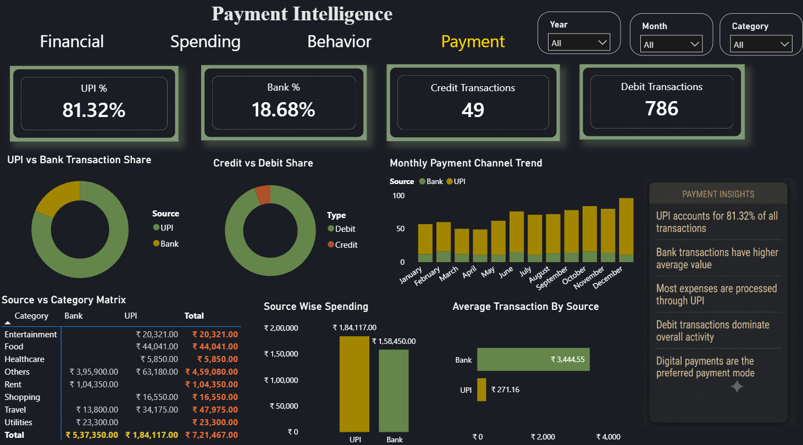

# 💰 Smart Personal Finance Intelligence Dashboard

_Transforming raw banking and UPI transaction data into actionable financial insights using SQL, Python, and Power BI._

---

## 📌 Table of Contents
- <a href="#overview">Overview</a>
- <a href="#business-problem">Business Problem</a>
- <a href="#dataset">Dataset</a>
- <a href="#tools--technologies">Tools & Technologies</a>
- <a href="#project-structure">Project Structure</a>
- <a href="#project-workflow">Project Workflow</a>
- <a href="#dashboard-preview">Dashboard Preview</a>
- <a href="#dashboard-pages">Dashboard Pages</a>
- <a href="#key-insights">Key Insights</a>
- <a href="#how-to-run-this-project">How to Run This Project</a>
- <a href="#business-benefits">Business Benefits</a>
- <a href="#future-improvements">Future Improvements</a>
- <a href="#author--contact">Author & Contact</a>

---
<h2><a class="anchor" id="overview"></a>Overview</h2>

This is an end-to-end Personal Finance Analytics project that transforms raw banking and UPI transaction data into meaningful financial insights. It helps users understand their income, expenses, savings, payment habits, spending behaviour, and overall financial health through an interactive, multi-page Power BI dashboard.

The pipeline covers the full analytics lifecycle: data cleaning and feature engineering in Python, exploratory and aggregate analysis in SQL, and interactive visualization in Power BI.

---
<h2><a class="anchor" id="business-problem"></a>Business Problem</h2>

Most people track spending in scattered bank statements or UPI apps with no unified view of their finances. This project aims to:

- Track income and expenses in one place
- Monitor savings rate and financial health over time
- Identify major spending categories and top merchants
- Analyze payment mode preferences (UPI vs Bank, Credit vs Debit)
- Understand weekday vs weekend spending behaviour
- Support better, data-driven financial decision making

---
<h2><a class="anchor" id="dataset"></a>Dataset</h2>

Personal Finance Transactions Dataset, containing:

- Income
- Expenses
- Categories
- Merchants
- Payment Mode
- Date
- Transaction Amount

Files: `data/Data.xlsx`, `data/finance_dashboard_dataset.xlsx`

---
<h2><a class="anchor" id="tools--technologies"></a>Tools & Technologies</h2>

- **Python** — Pandas, NumPy, Matplotlib, Seaborn
- **SQL** — Data validation, aggregations, category & merchant analysis
- **Power BI** — Interactive dashboard, DAX measures, bookmarks, drill-downs
- **Excel** — Source data handling

---
<h2><a class="anchor" id="project-structure"></a>Project Structure</h2>

```
smart-personal-finance-dashboard-sql-python-powerbi/
│
├── README.md
├── data/
│   ├── Data.xlsx
│   └── finance_dashboard_dataset.xlsx
│
├── notebook/
│   └── Coding.ipynb
│
├── SQL/
│   └── smart-finance-dashboard.sql.sql
│
├── dashboard/
│   └── Smart Personal Finance Intelligence Dashboard.pbix
│
└── Images/
    ├── Page1_Financial_Overview.png
    ├── Page2_Spending_Analysis.png
    ├── Page3_Behavior_Analysis.png
    └── Page4_Payment_Analysis.png
```

---
<h2><a class="anchor" id="project-workflow"></a>Project Workflow</h2>

```
Raw Dataset
     ↓
Python Data Cleaning
     ↓
Feature Engineering
     ↓
Exploratory Data Analysis (EDA)
     ↓
SQL Analysis
     ↓
Power BI Dashboard
     ↓
Business Insights
```

---
<h2><a class="anchor" id="dashboard-preview"></a>Dashboard Preview</h2>

### Financial Overview


### Spending Intelligence


### Financial Behavior


### Payment Intelligence


---
<h2><a class="anchor" id="dashboard-pages"></a>Dashboard Pages</h2>

**1. Financial Overview**
- KPIs: Total Income, Total Expense, Net Savings, Savings Rate, Total Transactions
- Visuals: Income vs Expense Trend, Financial Growth, Monthly Cash Flow, Financial Insights

**2. Spending Intelligence**
- KPIs: Largest Category, Top Merchant Spend, Highest Transaction, Most Used Merchant
- Visuals: Category Distribution, Merchant Analysis, Top Spending Merchants, Treemap, Category Split

**3. Financial Behavior**
- KPIs: Average Daily Spend, Average Monthly Spend, Weekend Spend %, Transactions Per Day
- Visuals: Weekly Spending Pattern, Monthly Trend, Transaction Size Distribution, Weekend vs Weekday Analysis, Category Group Treemap

**4. Payment Intelligence**
- KPIs: UPI %, Bank %, Credit Transactions, Debit Transactions
- Visuals: UPI vs Bank Share, Credit vs Debit Share, Monthly Payment Trend, Average Transaction by Source, Payment Insights

---
<h2><a class="anchor" id="key-insights"></a>Key Insights</h2>

- UPI is the most preferred payment method
- Rent contributes the highest expense category
- Debit transactions dominate overall payment activity
- Weekend spending is lower than weekday spending
- Zomato is the most frequently used merchant
- Overall financial health score is **Good**
- Savings rate is approximately **9.6%**

---
<h2><a class="anchor" id="how-to-run-this-project"></a>How to Run This Project</h2>

1. Clone the repository:
```bash
git clone https://github.com/RenukaN-com/smart-personal-finance-dashboard-sql-python-powerbi.git
```
2. Explore the dataset:
   - `data/Data.xlsx`
   - `data/finance_dashboard_dataset.xlsx`
3. Run the Python notebook for cleaning, feature engineering, and EDA:
   - `notebook/Coding.ipynb`
4. Run the SQL analysis:
   - `SQL/smart-finance-dashboard.sql.sql`
5. Open the Power BI dashboard:
   - `dashboard/Smart Personal Finance Intelligence Dashboard.pbix`

---
<h2><a class="anchor" id="business-benefits"></a>Business Benefits</h2>

- Monitor monthly income and expenses at a glance
- Improve savings habits with clear savings-rate tracking
- Identify unnecessary or high-impact spending categories
- Track payment behaviour across UPI, bank, credit, and debit
- Support better personal budgeting and financial planning

---
<h2><a class="anchor" id="future-improvements"></a>Future Improvements</h2>

- Forecast future expenses using time-series models
- AI-based spending recommendations
- Budget alerts and threshold notifications
- Credit score integration
- Mobile-friendly dashboard version

---
<h2><a class="anchor" id="author--contact"></a>Author & Contact</h2>

**Renuka Nival**
AI & Data Science Graduate

Skills: Python · SQL · Power BI · Tableau · Machine Learning · Data Analytics

🔗 GitHub: [RenukaN-com](https://github.com/RenukaN-com)
🔗 LinkedIn: [Renuka Nival](https://www.linkedin.com/in/renuka-nival-797225231/)
